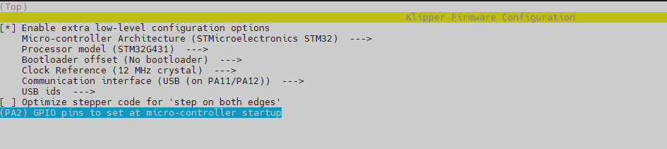
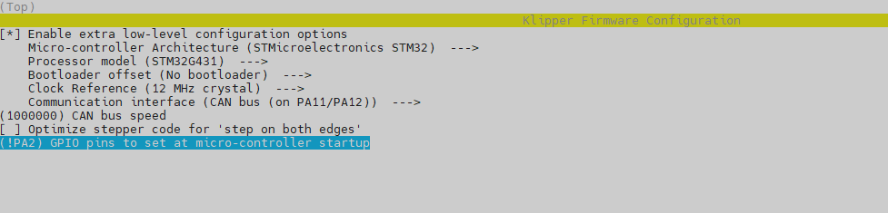

# H36_Combo V2.0
H36 Combo V2.0 is a newly designed 125℃ high temperature tool board Based on STMG431CBT3.

> [!IMPORTANT] 
>- Since there is no 125 degree Celsius USB-HUB chip, the 125 degree Celsius operating environment is limited to CANBUS mode；
>- Klipper currently does not support 125 degree Celsius accelerometers, so the 125 degree Celsius operating environment does not include accelerometers. The default version of H36 is ADXL345, which has a maximum operating temperature of 85 degrees Celsius. The 105 degree Celsius ADXL345-EP version is optional, but it is more expensive.

## Flashing for Klipper

### USB 

- [*] Enable extra low-level configuration options 
- Micro-controller Architecture (STMicroelectronics STM32)
- Processor model (STM32G431)
- Bootloader offset (No bootloader)
- Clock Reference (12 Mhz crystal)
- Communication interface (USB (on PA11/PA12))
- USB ids (leave default)
- (PA2) GPIO pins to set at micro-controller startup

### CAN

- [*] Enable extra low-level configuration options 
- Micro-controller Architecture (STMicroelectronics STM32)
- Processor model (STM32G431)
- Bootloader offset (No bootloader)
- Clock Reference (12 Mhz crystal)
- Communication interface (CAN bus (on PA11/PA12))
- (1000000) CAN bus speed
- (!PA2) GPIO pins to set at micro-controller startup

